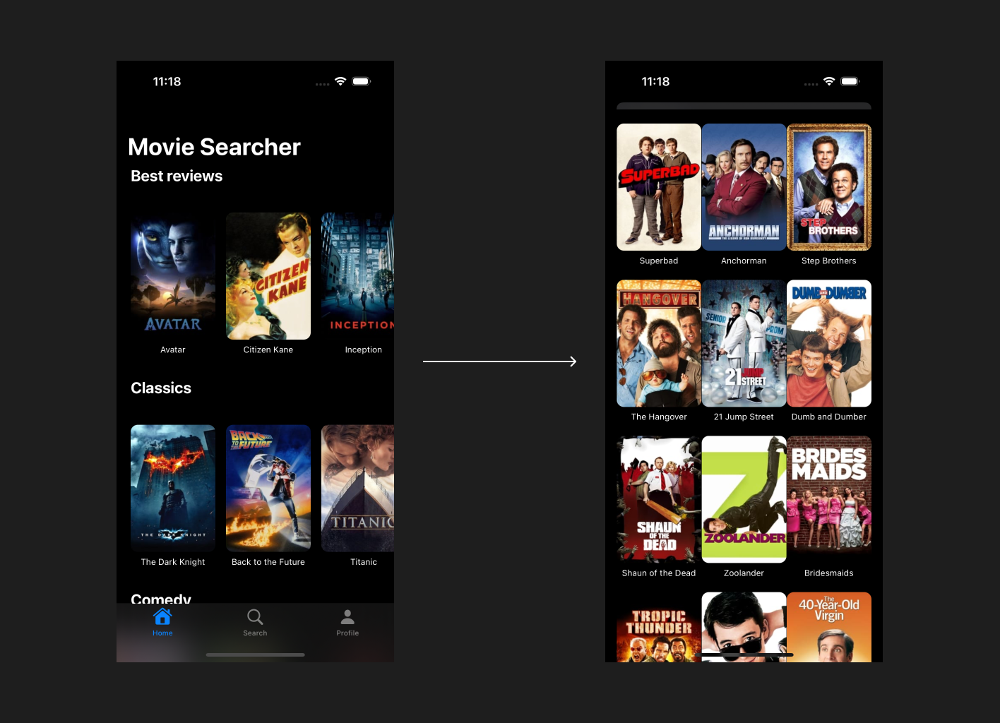

# MovieFinder

MovieFinder is a mobile application developed in Swift for iPhone and iPad that allows users to search for movies, view details about them, and manage movies they've watched. It uses the TMDB (The Movie Database) API to fetch information such as synopses, posters, trailers, and movie categories.

## Features

- **Movie Search**: Allows users to search for movies by name.
- **Movie Details**: Displays synopses, posters, and trailers for each movie.
- **Category Filtering**: Browse movies by categories such as action, comedy, drama, etc.
- **User Profile**: Save movies you've watched to your personal profile.
- **Compatibility**: The app is optimized for both iPhone and iPad.

## Technical Details

### **Architecture**
The app follows the MVVM (Model-View-ViewModel) architecture to ensure modularity and ease of maintenance.  

- **Model**: Represents movie-related data fetched from the TMDB API.
- **ViewModel**: Handles the application's business logic, including fetching movies, filtering data, and managing app states using `@Published` properties for SwiftUI reactivity.
- **View**: Built with SwiftUI to bind UI components to data from the ViewModel.  

### **Core Functionality**
The app integrates with the TMDB API using asynchronous calls. The `MoviesViewModel` class, for instance:  
- Fetches movies by title.  
- Retrieves video trailers for selected movies.  
- Manages state for the currently selected movie, search results, and UI navigation.  

API calls are made using `URLSession`, and data is parsed with `JSONDecoder`. Error handling ensures graceful failure during network issues or unexpected API responses.

---

## Technologies Used

- **Swift**: Programming language for iOS app development.  
- **SwiftUI**: Declarative framework for building the user interface.  
- **Combine Framework**: Manages data flow and updates between the ViewModel and UI.  
- **TMDB API**: Provides movie data.  
- **URLSession**: Facilitates network requests.  
- **JSONDecoder**: Decodes API responses into app models.  

---

## Installation 

1. Clone this repository to your local machine:

   ```bash
   git clone https://github.com/brendabarraza/MoviesApps.git


---


## Figma Prototype

You can view the Figma prototype of the app [here](https://www.figma.com/proto/aCtVNm5U7a7kZBKAJvdYQa/Untitled?node-id=10-31&node-type=canvas&t=fajOnrOFzDMhviI8-1&scaling=scale-down&content-scaling=fixed&page-id=5%3A2).


